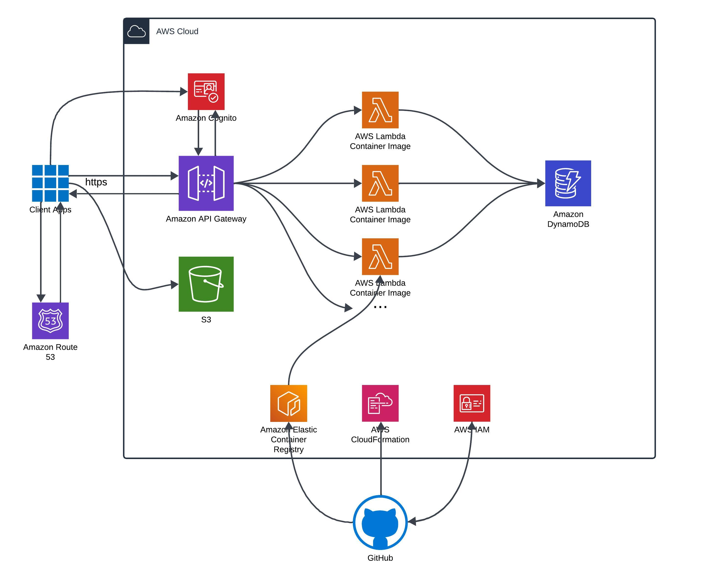

# rentalninja-graalvm-quarkus

### Introduction:
* This is the quarkus with GraalVM and native images version of backend services for project RentalNinja, our goal is to build a **apartment rental platform** for international student

### Our Distributed System Architecture:

### Tech stacks we used:

* Uses **`Java 17`** Amazon Corretto
* Uses [Quarkus](https://github.com/quarkusio/quarkus) framework.
* Uses [GraalVM](https://github.com/graalvm) with native images build to improve the performance.
* Uses the [AWS API Gateway](https://aws.amazon.com/api-gateway/) to route incoming traffic and authorize tokens.
* Uses [AWS Cognito](https://aws.amazon.com/cognito/) for seamlessly SignIn/SignUp user experience.
* Uses [AWS Lambda](https://aws.amazon.com/lambda/) as our business logic layer.
* Uses [AWS DynamoDB](https://aws.amazon.com/dynamodb/) to store our application data.
* Uses [AWS S3](https://aws.amazon.com/s3/) to store user images.
* Uses [AWS Route53](https://aws.amazon.com/route53/) as DNS provider and domain register.
* Uses [AWS ECR](https://aws.amazon.com/ecr/) to store docker images.
* Uses [AWS CloudFormation](https://github.com/aws-cloudformation) to achieve infrastructure as code.
* Uses [Github Action](https://github.com/actions) for CI/CD pipeline.
* Uses [Docker](https://github.com/docker) to containerize our lambda functions.